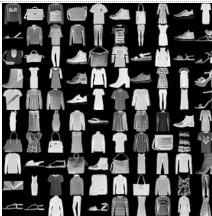
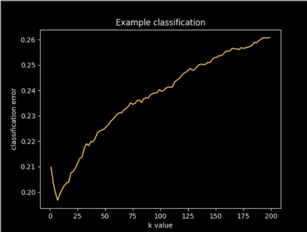
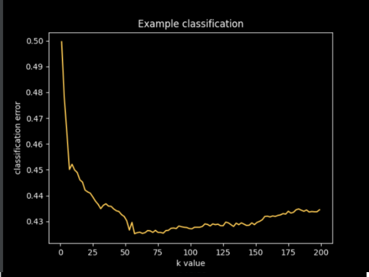
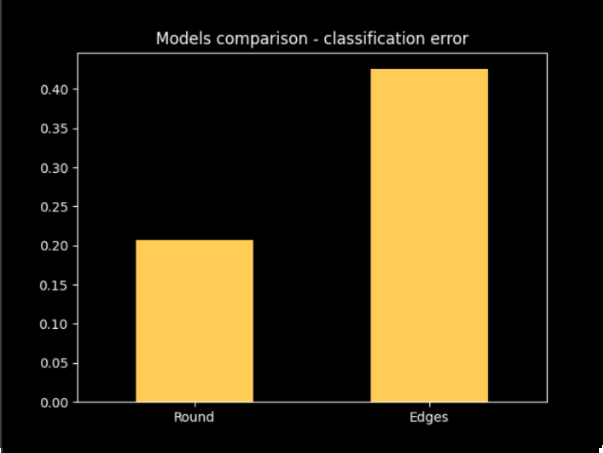
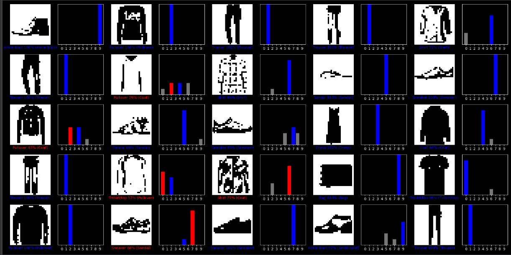
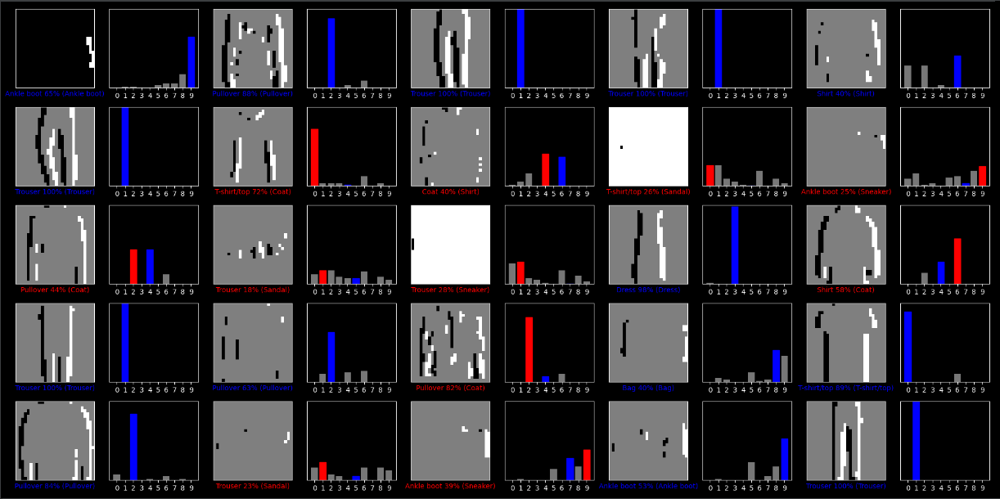

# ## Table of content:
Introduction
Methods
Results
Usage

# Introduction
The task is to create a model that will be able to assign a picture of clothing to the appropriate category.
Pictures used in program are from Fasion-MNIST dataset. Each example is a 28x28 grayscale image and is associated with a label. 

Dataset is divided into three parts:
1. Train – 50,000 examples
2. Validation – 10,000 examples
3. Test – 10,000 examples

There is total od 10 labels:
| Label | Description |
| ------ | ------ |
|0      |   T-shirt/top
|1      |   Trouser
|2      |   Pullover
|3      |   Dress
|4      |   Coat
|5      |   Sandal
|6      |   Shirt
|7      |   Sneaker
|8      |   Bag
|9      |   Ankle boot

Image is read by a program as a matrix of numeric values in range from 0 to 255. Rows and columns represent the position of the pixel in the image and the value represents color. The goal is to predict to which class a new image should belong based on already labeled pictures.

Example of pictures used in model:

To accomplish the goal, we need to calculate the probability of the image belonging to each of the given classes and pick the class for which the probability is the highest.

# Methods
## Algorithm

I’ve decided to try using the k-nearest neighbors algorithm. It is a non-parametric classification method. Classification is based on k pictures that are “closest” to the given picture in a train set. 

k-NN model depends on the training set and value of k parameter, so it does not require any additional training steps.

Distance between objects is calculated using Hamming distance. Every picture representation is turned into a one-dimensional array. When values on corresponding fields are different, the result sum of the algorithm is increased. The lower the result is, the more similar are the images. If the images are identical, Hamming distance will return 0.

For every image we find k closest images from the train set. Next we count occurrences of every class in the picked sample and divide the score by k. By that we receive probabilities of image belonging to each class. The final prediction is the class with the highest probability.

Only parameter that is not known by this point is the number of images that will be compared – k. It will be decided based on accuracy for the validation set. The k which generates the smallest error will be the final one used for the algorithm.

Standard classification error is calculated as the number of misclassified objects to all objects in the test.

## Data Preparation

Images represented by matrices of values do not require any additional action before comparing them. 

First, as hamming distance counts every slight difference in values, I’d like to try rounding values. After division by 255 (needed for accurate display of images), the values are in range from 0 to 1. However, the implementation of Hamming distance I’ve decided to use requires matrices to contain only zeros and ones. To achieve that, I’m rounding every value. 

I’m comparing values from unchanged images to images of edges.

# Results

After comparing models on validation data we get best parameters:

For rounded values best k is 7, with error = 0.1968

For edges best k is 57, with error = 0.4252

Using picked parameters models on test datasets got following results:

| Name | Parameters | Error
| -- | -- | --
k-NN (rounded) | k:7 | 0.2068
k-NN (edges) | k: 57 | 0.4256

Example of data classification for 25 images:

Rounded:

Edges:

# Usage

Data is already included in the project. All pictures are from https://github.com/zalandoresearch/fashion-mnist

Program uses:
 - Python 3.8
 - Matplotlib
 - Numpy
 - Scikit-image

To run a program clone or download a repository and open it in python IDE or start main.py from the command line.

